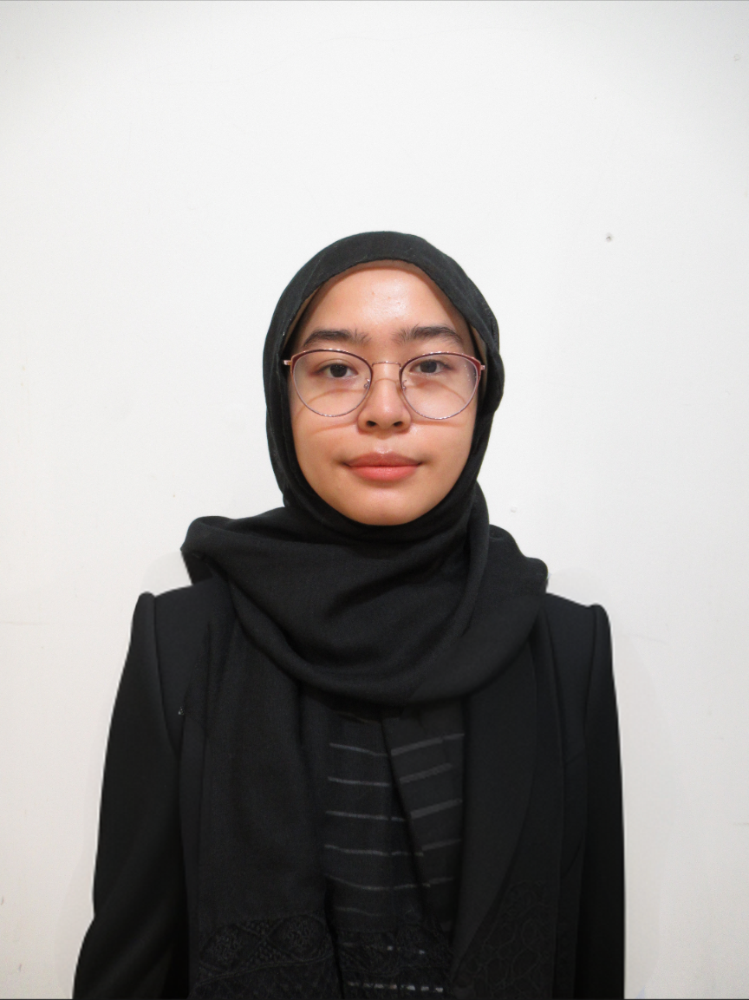

# Introduction
Hi! I'm Nur Faiqah binti Ahmad Azman, a student in the Software Maintenance and Evolution course.
I expect to learn a lot about modern software maintenance practices and how to work with legacy systems.
- **Fun fact**: I’m a language enthusiast! Currently, I’m learning Malaysian Sign Language (BIM) and love how it adds another layer of understanding to inclusive design..
- **Course expectations**: To gain hands-on experience in maintaining and evolving software.

## GitHub Profile
You can view my personalized GitHub profile
[here](https://github.com/faiqahAzman).
